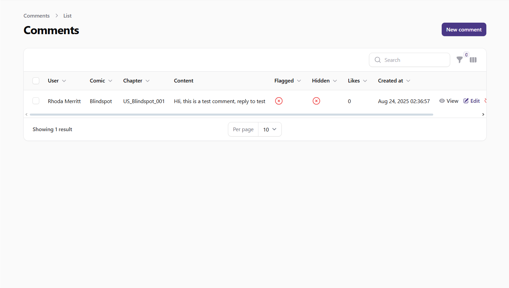
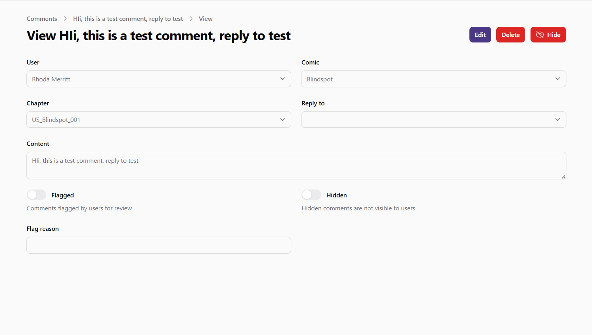
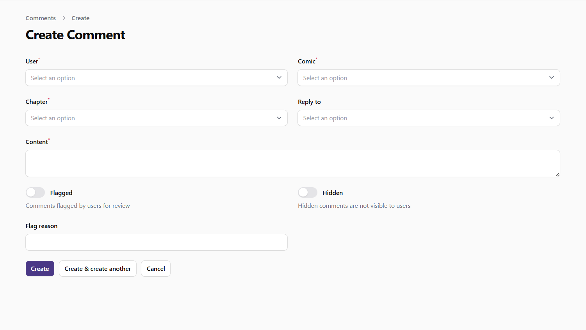
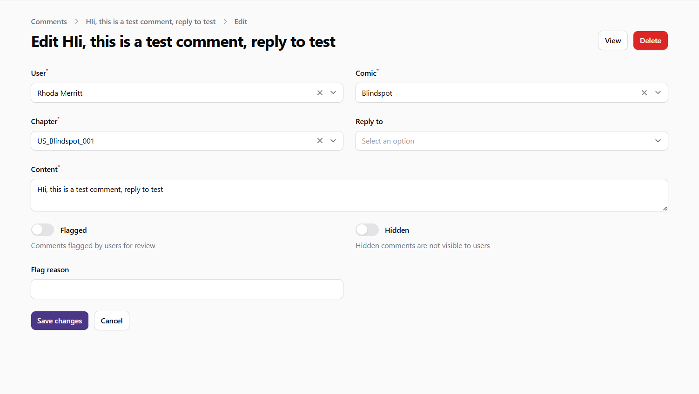

# Managing Comments

This guide explains how to manage and moderate user comments in the admin panel. As an administrator, you can review, edit, approve, hide, and delete comments to maintain a positive community environment.

## Accessing the Comments Section

1. Log in to the admin panel with your administrator credentials
2. Navigate to the **Content** section in the sidebar
3. Click on **Comments** to access the comment management interface

## Viewing Comments

The Comments page displays a table with all comments in the system. The table includes the following information:

- **User**: The name of the user who posted the comment
- **Comic**: The comic the comment is associated with
- **Chapter**: The specific chapter the comment is on
- **Content**: The text of the comment
- **Flagged**: Whether the comment has been flagged for review
- **Hidden**: Whether the comment is hidden from users
- **Likes**: The number of likes the comment has received
- **Created At**: When the comment was posted

You can:
- **Search** for comments by content, user, comic, or chapter
- **Sort** the table by clicking on column headers
- **Filter** comments based on various criteria:
  - Flagged comments
  - Hidden comments
  - Visible comments
  - Comments by specific users
  - Comments on specific comics or chapters
  - Deleted comments (using the Trashed filter)

*Screenshot: Comments list view*

## Viewing Comment Details

To view detailed information about a comment:

1. Find the comment in the table
2. Click on the **View** button (eye icon) in the actions column

The comment detail page shows comprehensive information about the comment, including:

- Full comment content
- User information
- Associated comic and chapter
- Parent comment (if it's a reply)
- Moderation status (flagged, hidden)
- Flag reason (if applicable)
- Timestamps

*Screenshot: Comment details view*

## Creating a New Comment

While comments are typically created by users on the frontend, administrators can create comments if needed:

1. Click the **New Comment** button at the top of the Comments page
2. Fill in the required information:
   - **User**: Select the user who is posting the comment
   - **Comic**: Select the comic the comment is for
   - **Chapter**: Select the chapter the comment is for
   - **Reply to**: If this is a reply to another comment, select the parent comment (optional)
   - **Content**: Enter the text of the comment
   - **Flagged**: Toggle if the comment should be flagged for review
   - **Hidden**: Toggle if the comment should be hidden from users
   - **Flag Reason**: Enter a reason if the comment is flagged (optional)
3. Click **Create** to add the new comment

*Screenshot: Create comment form*

## Editing a Comment

To edit an existing comment:

1. Find the comment in the table
2. Click the **Edit** button (pencil icon) in the actions column
3. Update the comment information as needed:
   - **User**: Change the user associated with the comment
   - **Comic**: Change the associated comic
   - **Chapter**: Change the associated chapter
   - **Reply to**: Change the parent comment (if applicable)
   - **Content**: Edit the text of the comment
   - **Flagged**: Toggle the flagged status
   - **Hidden**: Toggle the hidden status
   - **Flag Reason**: Update the flag reason (if applicable)
4. Click **Save** to apply your changes

*Screenshot: Edit comment form*

## Moderating Comments

Comment moderation is a key responsibility for administrators. The system provides several actions to help manage comments effectively:

### Approving Comments

To approve a flagged or hidden comment:

1. Find the comment in the table
2. Click the **Approve** button (check icon) in the actions column
3. The comment will be unflagged and made visible to users

### Hiding Comments

To hide a comment from users:

1. Find the comment in the table
2. Click the **Hide** button (eye-slash icon) in the actions column
3. The comment will be hidden from users but still visible to administrators

### Showing Comments

To make a hidden comment visible again:

1. Find the comment in the table
2. Click the **Show** button (eye icon) in the actions column
3. The comment will become visible to users again

### Deleting Comments

To delete a comment:

1. Find the comment in the table
2. Click the **Delete** button (trash icon) in the actions column
3. Confirm the deletion when prompted

Deleted comments are moved to trash and can be restored if needed.

### Restoring Deleted Comments

To restore a deleted comment:

1. Use the **Trashed** filter to view deleted comments
2. Find the comment in the table
3. Click the **Restore** button in the actions column

### Permanently Deleting Comments

To permanently delete a comment:

1. Use the **Trashed** filter to view deleted comments
2. Find the comment in the table
3. Click the **Force Delete** button in the actions column
4. Confirm the permanent deletion when prompted

## Bulk Actions

You can perform actions on multiple comments at once:

1. Select comments by checking the boxes next to them
2. Use the bulk actions menu to choose an action:
   - **Approve Selected**: Approve multiple flagged or hidden comments
   - **Hide Selected**: Hide multiple comments from users
   - **Show Selected**: Make multiple hidden comments visible
   - **Delete Selected**: Move multiple comments to trash
   - **Restore Selected**: Restore multiple deleted comments
   - **Force Delete Selected**: Permanently delete multiple comments

## Managing Flagged Comments

Comments can be flagged by users when they contain inappropriate content. To manage flagged comments:

1. Use the **Flagged** filter to view all flagged comments
2. Review each flagged comment and its flag reason
3. Take appropriate action:
   - **Approve**: If the comment is appropriate and should remain visible
   - **Hide**: If the comment violates community guidelines
   - **Edit**: To modify problematic parts of the comment
   - **Delete**: To remove the comment entirely

## Best Practices

- Regularly review flagged comments to maintain a positive community
- Be consistent in applying community guidelines
- Consider the context of comments before taking moderation actions
- Use bulk actions for efficient moderation of multiple similar comments
- Keep an eye on users who consistently have comments flagged or hidden
- Respond promptly to inappropriate content to maintain community trust
- Document your moderation decisions for transparency and consistency