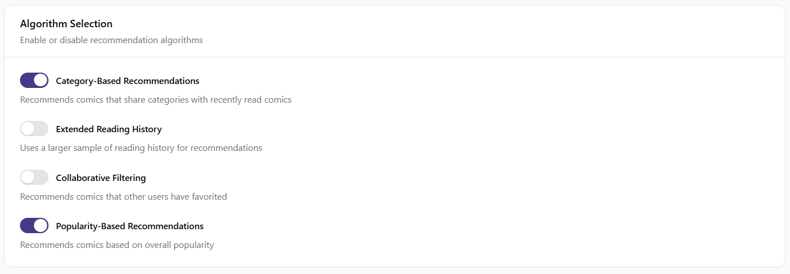
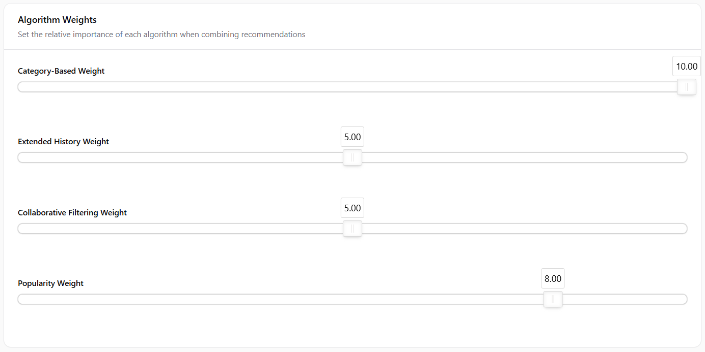
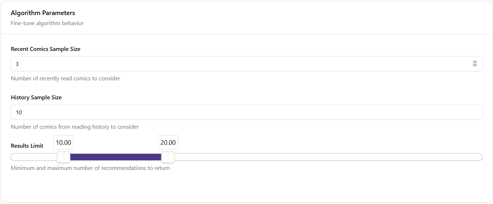

# Managing Recommendation Algorithms

This document provides a comprehensive guide on how the recommendation algorithms work in Snacktoons and how administrators can configure them to enhance user experience.

## Overview

Snacktoons uses a smart recommendation system that suggests comics to users based on their reading history, favorites, and overall comic popularity. The system can use multiple algorithms simultaneously and combine their results for the best user experience.

The recommendation system is designed to:
- Help users discover new comics they might enjoy
- Increase engagement by showing relevant content
- Promote content discovery across different categories
- Provide personalized experiences for each user

## Available Algorithms

### 1. Category-Based Recommendations

**How it works**: Suggests comics that share categories with comics the user has recently read.

- The system identifies categories from the user's recently read comics
- It then finds other comics in those same categories
- These comics are presented as "Because you read [Comic Title]"

**Best for**: Providing recommendations closely related to a user's current interests.

**Default**: Enabled with weight 10 (highest priority)

### 2. Extended Reading History

**How it works**: Analyzes a larger sample of the user's reading history to identify category patterns and preferences.

- Examines up to 10 comics from the user's reading history (configurable)
- Identifies common categories across these comics
- Recommends comics from these categories that the user hasn't read yet

**Best for**: Users with established reading patterns and preferences.

**Default**: Disabled with weight 5 (medium priority)

### 3. Collaborative Filtering

**How it works**: Recommends comics that other users have favorited but the current user hasn't seen yet.

- Identifies comics that have been favorited by many users
- Excludes comics the current user has already favorited
- Presents these as recommendations

**Best for**: Discovering popular comics that align with the user's taste.

**Default**: Disabled with weight 5 (medium priority)

### 4. Popularity-Based

**How it works**: Recommends comics based on overall popularity, calculated using a weighted scoring system of favorites and reads.

- Identifies the most favorited comics (weight: 2 points per favorite)
- Identifies the most read comics (weight: 1 point per read)
- Determines the most popular categories based on these scores
- Recommends comics from these popular categories

**Best for**: New users or users with limited history, and for highlighting trending content.

**Default**: Enabled with weight 8 (high priority)

## How Algorithms Are Combined

When multiple algorithms are enabled, the system:

1. Collects recommendations from each enabled algorithm
2. Assigns a score to each recommendation based on the algorithm's weight
3. Combines duplicate recommendations and adds their scores
4. Sorts recommendations by their final score
5. Returns the top-scoring recommendations

This approach ensures that comics recommended by multiple algorithms receive higher priority.

## Configuring Recommendation Algorithms

Administrators can configure the recommendation system through the admin panel at **Settings > Recommendation Algorithms**.

### Algorithm Selection

- **Category-Based Recommendations**: Toggle to enable/disable recommendations based on recently read comics' categories
- **Extended Reading History**: Toggle to enable/disable recommendations based on a larger sample of reading history
- **Collaborative Filtering**: Toggle to enable/disable recommendations based on what other users have favorited
- **Popularity-Based Recommendations**: Toggle to enable/disable recommendations based on overall comic popularity

### Algorithm Weights

Adjust the importance of each algorithm on a scale of 0-10:

- **Category-Based Weight**: How much priority to give to category-based recommendations
- **Extended History Weight**: How much priority to give to extended reading history recommendations
- **Collaborative Filtering Weight**: How much priority to give to collaborative filtering recommendations
- **Popularity Weight**: How much priority to give to popularity-based recommendations

Higher weights give that algorithm's recommendations more influence in the final results.

### Algorithm Parameters

Fine-tune how the algorithms work:

- **Recent Comics Sample Size**: Number of recently read comics to consider (default: 3)
- **History Sample Size**: Number of comics from reading history to analyze (default: 10)
- **Results Limit**: Minimum and maximum number of recommendations to show (default: 10-20)

## Best Practices

### 1. Start Simple

Begin with Category-Based and Popularity-Based algorithms enabled:
- Category-Based provides personalized recommendations
- Popularity-Based ensures new users get quality recommendations

### 2. Adjust Gradually

Make small changes to weights and observe the results:
- Increase weights for algorithms that generate more user engagement
- Decrease weights for algorithms that don't perform well

### 3. Consider Your Content Library

Tailor your algorithm selection based on your content:
- For diverse content libraries, enable multiple algorithms
- For specialized content, focus on category-based recommendations

### 4. Monitor User Engagement

Track which recommendations lead to more reads:
- Look for patterns in which algorithm generates more clicks
- Adjust weights accordingly to favor better-performing algorithms

### 5. Seasonal Adjustments

Consider adjusting algorithms for special events or promotions:
- Increase popularity weight during new content launches
- Emphasize category-based recommendations for themed events

## Technical Implementation

The recommendation system is implemented in the `ComicManager` class and uses the following methods:

- `recommendComicsByRecentlyRead`: Implements Category-Based Recommendations
- `recommendComicsBasedOnReadingHistory`: Implements Extended Reading History
- `recommendMostFavoriteComics`: Implements Collaborative Filtering
- `getPopularComics`: Implements Popularity-Based Recommendations
- `getRecommendations`: Combines all enabled algorithms based on configuration
- `combineRecommendations`: Merges and weights recommendations from different sources

## Troubleshooting

### No Recommendations Appearing

If users aren't seeing recommendations:

1. Check that at least one algorithm is enabled
2. Verify that the minimum results limit isn't set too high
3. Ensure users have some reading history (for personalized recommendations)
4. Check that comics have categories assigned (for category-based recommendations)

### Poor Quality Recommendations

If recommendations don't seem relevant:

1. Adjust algorithm weights to favor better-performing methods
2. Review category assignments on comics
3. Consider enabling additional algorithms for more diverse recommendations
4. Increase the sample size for reading history
