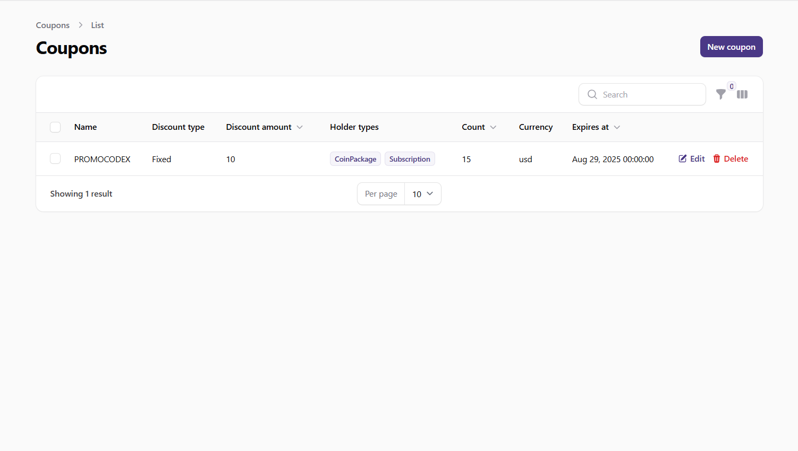
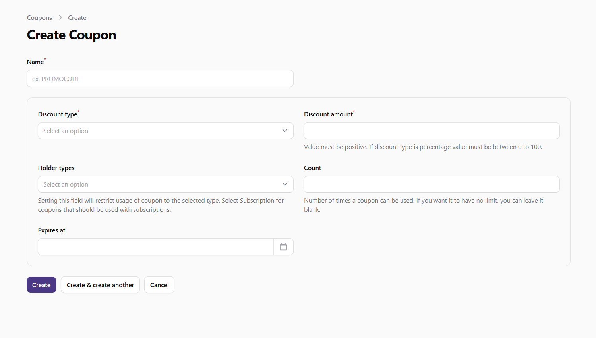

# Managing Coupons

This guide explains how to create and manage discount coupons in the admin panel. Coupons allow you to offer discounts to users for subscription plans and coin packages, helping to drive sales and reward loyal customers.

## Understanding Coupon Integration with Stripe

Coupons created in the admin panel are automatically synchronized with your Stripe account. When you create or update a coupon in the admin panel:

1. The system creates a corresponding coupon in your Stripe account
2. The coupon details (discount amount, duration, etc.) are synchronized between your platform and Stripe
3. When users apply coupons during checkout, the discount is processed through Stripe's payment system

This integration ensures that your discount system works seamlessly with your payment processing.

## Accessing the Coupons Section

1. Log in to the admin panel with your administrator credentials
2. Navigate to the **Settings** section in the sidebar
3. Click on **Coupons** to access the coupon management interface

## Viewing Coupons

The Coupons page displays a table with all coupons in the system. The table includes the following information:

- **Name**: The coupon code that users will enter (e.g., SUMMER2023)
- **Discount Type**: Whether the discount is a fixed amount or a percentage
- **Discount Amount**: The value of the discount
- **Holder Types**: What the coupon can be applied to (Subscription, CoinPackage, or both)
- **Count**: How many times the coupon can be used (blank means unlimited)
- **Currency**: The currency for fixed-amount discounts
- **Expires At**: When the coupon will expire (if applicable)

*Screenshot: Coupons list view*

## Creating a New Coupon

To create a new coupon:

1. Click the **New Coupon** button at the top of the Coupons page
2. Fill in the required information:
   - **Name**: Enter a unique coupon code (uppercase alphanumeric characters only)
   - **Discount Type**: Choose between:
     - **Fixed**: A specific amount off the price (e.g., $5 off)
     - **Percentage**: A percentage discount (e.g., 10% off)
   - **Discount Amount**: Enter the discount value (for percentage, enter a number between 1-100)
   - **Holder Types**: Select where the coupon can be used:
     - **CoinPackage**: For discounts on coin purchases
     - **Subscription**: For discounts on subscription plans
     - Both can be selected to make the coupon work for either type
   - **Count**: (Optional) Set a limit on how many times the coupon can be used
   - **Expires At**: (Optional) Set an expiration date and time for the coupon
3. Click **Create** to add the new coupon

*Screenshot: Create coupon form*

## Editing and Deleting Coupons

### Editing a Coupon

Some coupon properties cannot be changed after creation to maintain consistency with Stripe and purchase records. To edit a coupon:

1. Find the coupon in the list and click the **Edit** button
2. Modify the available fields
3. Click **Save** to update the coupon

### Deleting a Coupon

To delete a coupon:

1. Find the coupon in the list and click the **Delete** button
2. Confirm the deletion when prompted

Deleted coupons are soft-deleted (trashed) rather than permanently removed. This preserves historical data for purchases that used the coupon.

## Monitoring Coupon Usage

To monitor how your coupons are being used:

1. Check the **Count** field in the coupons list to see how many times a limited coupon has been used
2. Review payment records to see which purchases have used specific coupons
3. Use analytics tools to track conversion rates for different coupon campaigns

## Best Practices for Coupon Management

- **Clear Naming**: Use descriptive, memorable coupon codes that are easy to type and remember
- **Limited-Time Offers**: Set expiration dates to create urgency and drive conversions
- **Strategic Discounts**: Balance discount amounts to be attractive to users while maintaining profitability
- **Targeted Campaigns**: Create specific coupons for different user segments or marketing channels
- **Usage Limits**: Consider setting usage limits for high-value coupons to control costs
- **Testing**: Test coupons before promoting them to ensure they work correctly
- **Promotion**: Clearly communicate coupon availability through email, social media, and in-app notifications

## Important Notes

- Coupon codes are case-sensitive and must be entered exactly as created
- Once a coupon is created, its discount type and amount cannot be changed to maintain consistency with past purchases
- Coupons with Stripe integration (for subscriptions) will appear in your Stripe dashboard
- Expired or fully-used coupons will automatically be rejected when users attempt to apply them
- Coupons can be applied to both one-time purchases (coin packages) and recurring subscriptions
