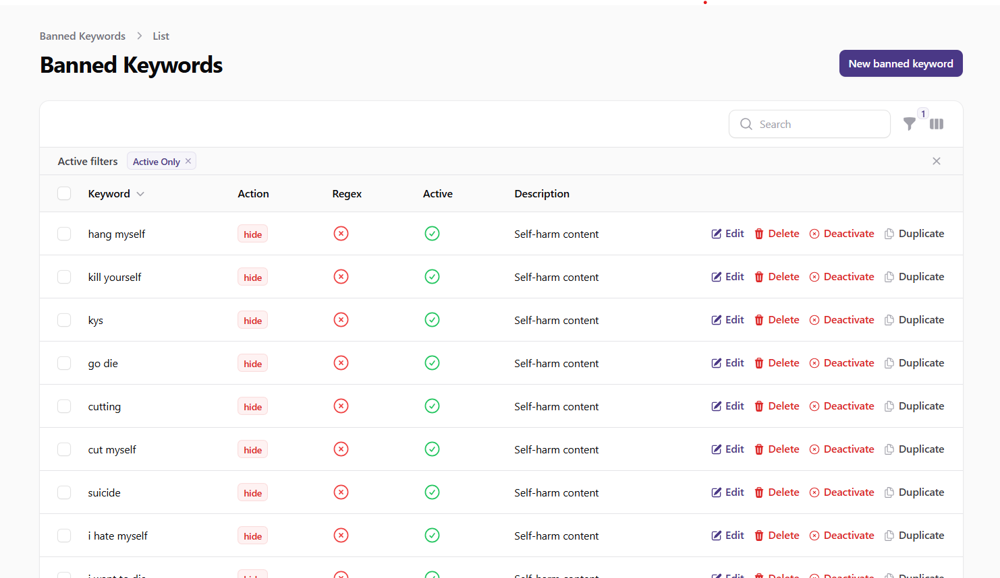
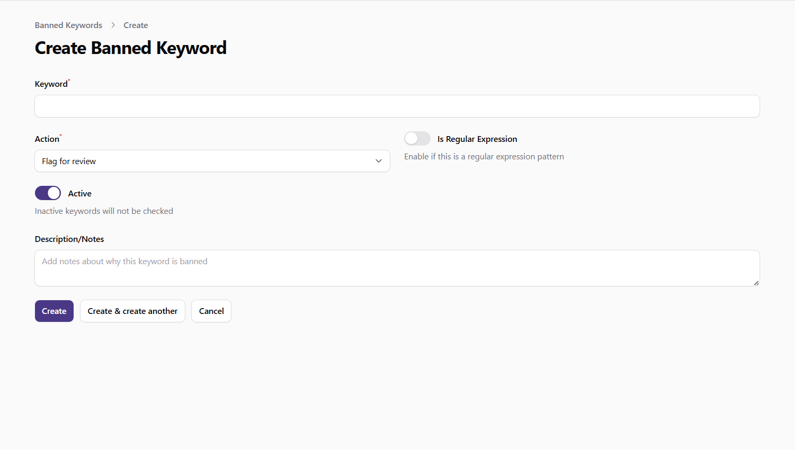
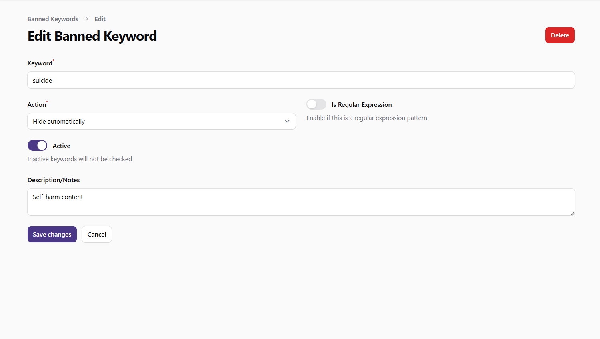

# Managing Banned Keywords

This guide explains how to set up and manage banned keywords in the admin panel. Banned keywords are used to automatically moderate content by flagging, hiding, or deleting content that contains inappropriate or prohibited terms.

## Accessing the Banned Keywords Section

1. Log in to the admin panel with your administrator credentials
2. Navigate to the **Content** section in the sidebar
3. Click on **Banned Keywords** to access the keyword management interface

## Viewing Banned Keywords

The Banned Keywords page displays a table with all configured keywords in the system. The table includes the following information:

- **Keyword**: The text or pattern to be detected
- **Action**: What happens when the keyword is detected (Flag, Hide, Delete)
- **Regex**: Whether the keyword is a regular expression pattern
- **Active**: Whether the keyword is currently active
- **Description**: Notes about the keyword's purpose

You can:
- **Search** for keywords by text or description
- **Sort** the table by clicking on column headers
- **Filter** keywords based on various criteria:
  - Action type (Flag, Hide, Delete)
  - Regular expressions only
  - Active keywords only
  - Inactive keywords only

*Screenshot: Banned keywords list view*

## Creating a New Banned Keyword

To create a new banned keyword:

1. Click the **New Banned Keyword** button at the top of the Banned Keywords page
2. Fill in the required information:
   - **Keyword**: Enter the text or pattern to be detected
   - **Action**: Select what happens when the keyword is detected:
     - **Flag for review**: Content with this keyword will be flagged for administrator review
     - **Hide automatically**: Content with this keyword will be automatically hidden from users
     - **Delete automatically**: Content with this keyword will be automatically deleted
   - **Is Regular Expression**: Toggle ON if the keyword is a regular expression pattern
   - **Active**: Toggle ON to make the keyword active immediately
   - **Description**: Add notes about why this keyword is banned
3. Click **Create** to add the new banned keyword

*Screenshot: Create banned keyword form*

## Editing a Banned Keyword

To edit an existing banned keyword:

1. Find the keyword in the table
2. Click the **Edit** button (pencil icon) in the actions column
3. Update the keyword information as needed:
   - **Keyword**: Modify the text or pattern
   - **Action**: Change the action taken when detected
   - **Is Regular Expression**: Toggle regex status
   - **Active**: Toggle active status
   - **Description**: Update notes about the keyword
4. Click **Save** to apply your changes

*Screenshot: Edit banned keyword form*

## Managing Keyword Status

You can quickly activate or deactivate keywords without editing the full record:

1. Find the keyword in the table
2. Click the **Activate** or **Deactivate** button in the actions column
3. The keyword's active status will be toggled immediately

Inactive keywords remain in the system but do not trigger any actions when detected in content.

## Duplicating Keywords

To create a similar keyword based on an existing one:

1. Find the keyword in the table
2. Click the **Duplicate** button in the actions column
3. A new keyword will be created with "(copy)" added to the original text
4. Edit the new keyword as needed

This is useful when creating variations of similar keywords or when testing different regex patterns.

## Deleting Keywords

To delete a keyword:

1. Find the keyword in the table
2. Click the **Delete** button (trash icon) in the actions column
3. Confirm the deletion when prompted

## Bulk Actions

You can perform actions on multiple keywords at once:

1. Select keywords by checking the boxes next to them
2. Use the bulk actions menu to choose an action:
   - **Delete Selected**: Remove multiple keywords
   - **Activate Selected**: Make multiple keywords active
   - **Deactivate Selected**: Make multiple keywords inactive
   - **Change Action**: Change the action for multiple keywords at once

## Using Regular Expressions

Regular expressions allow for more powerful pattern matching:

1. When creating or editing a keyword, toggle **Is Regular Expression** to ON
2. Enter a valid regex pattern in the keyword field
3. Add a description that explains what the pattern is designed to catch

Examples of useful regex patterns:
- `\b(bad|word|here)\b` - Matches any of the words "bad", "word", or "here" as whole words
- `\d{4}[- ]?\d{4}[- ]?\d{4}[- ]?\d{4}` - Matches credit card number patterns
- `\b[A-Za-z0-9._%+-]+@[A-Za-z0-9.-]+\.[A-Za-z]{2,}\b` - Matches email addresses

**Note**: Test your regex patterns thoroughly before activating them to avoid false positives.

## Best Practices

- **Start Conservative**: Begin with flagging rather than automatic hiding or deletion
- **Be Specific**: Use precise keywords to avoid false positives
- **Document Purpose**: Add clear descriptions to help other administrators understand why keywords are banned
- **Regular Review**: Periodically review your keyword list to ensure it remains effective
- **Consider Context**: Some words may be inappropriate in some contexts but acceptable in others
- **Use Regex Carefully**: Regular expressions are powerful but can cause unexpected matches if not carefully crafted
- **Test Before Activating**: Consider creating keywords in an inactive state first, then activating after review
- **Monitor Effectiveness**: Track how often keywords are triggered and adjust as needed

## Important Notes

- Banned keywords apply to all user-generated content, including comments, messages, and profile information
- Automatic actions (hide, delete) happen without administrator review, so use these options carefully
- Regular expressions can impact system performance if they are too complex or numerous
- Consider cultural and linguistic differences when creating banned keywords