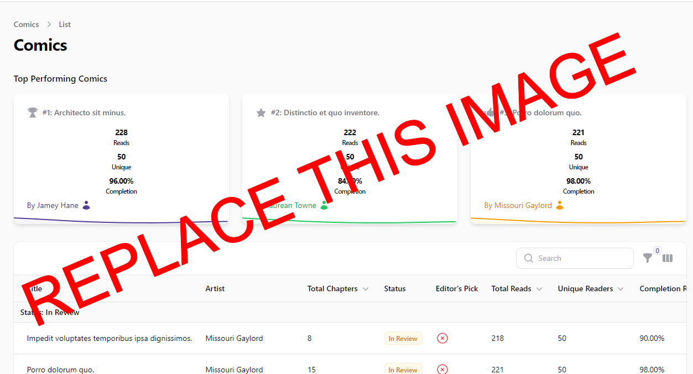

# Managing Readers

This guide explains how to manage readers (regular users) in the admin panel. As an administrator, you can view, edit, and manage reader accounts and their associated data.

## Accessing the Readers Section

1. Log in to the admin panel with your administrator credentials
2. Navigate to the main sidebar navigation
3. Click on **Readers** to access the reader management interface

## Viewing Readers

The Readers page displays a table with all reader accounts in the system. The table includes the following information:

- **Name**: The reader's full name
- **Email**: The reader's email address
- **Joined**: When the reader account was created

You can:
- **Search** for readers by name or email using the search bar
- **Sort** the table by clicking on column headers
- **Filter** readers based on various criteria

*Screenshot: Readers list view*

## Viewing Reader Details

To view detailed information about a reader:

1. Find the reader in the table
2. Click on the **View** button (eye icon) in the actions column

The reader detail page shows comprehensive information about the reader, including:

- Profile information (name, email)
- Reading history
- Reward points
- Subscriptions
- Coin purchases
- Referral information
- Bank details

*Screenshot: Reader details view*

## Editing a Reader

To edit a reader's basic information:

1. Find the reader in the table
2. Click the **Edit** button (pencil icon) in the actions column
3. Update the reader information as needed:
   - **Name**: Update the reader's name
   - **Email**: Update the reader's email address
4. Click **Save** to apply your changes

*Screenshot: Edit reader form*

## Managing Reading History

The Reading History section shows what comics and chapters the reader has viewed:

1. Navigate to the reader's detail page
2. Scroll to the **Reading History** section
3. View information such as:
   - Comics and chapters read
   - Reading timestamps
   - Completion status

This information helps you understand reader behavior and content popularity.

## Managing Reward Points

To view and manage a reader's reward points:

1. Navigate to the reader's detail page
2. Scroll to the **Reward Points** section
3. View information such as:
   - Current point balance
   - Point earning history
   - Point redemption history

## Managing Subscriptions

To view and manage a reader's subscriptions:

1. Navigate to the reader's detail page
2. Scroll to the **Subscriptions** section
3. View information such as:
   - Active subscriptions
   - Subscription history
   - Renewal dates
   - Payment status

## Managing Coin Purchases

To view a reader's coin purchase history:

1. Navigate to the reader's detail page
2. Scroll to the **Coin Purchases** section
3. View information such as:
   - Purchase dates
   - Coin package details
   - Payment amounts
   - Transaction status

## Managing Referrals

The referral system allows readers to earn rewards by referring new users:

1. Navigate to the reader's detail page
2. Scroll to the **Referral Payouts** section to see rewards earned from referrals
3. Check the **Referred Users** section to see which users were referred by this reader

## Managing Bank Details

To view a reader's bank information for payouts:

1. Navigate to the reader's detail page
2. Scroll to the **Bank Details** section
3. View the reader's payment information

## Bulk Actions

You can perform actions on multiple readers at once:

1. Select readers by checking the boxes next to their names
2. Use the bulk actions menu to choose an action:
   - **Delete**: Remove multiple reader accounts at once

**Note:** Be extremely cautious when using bulk delete as this action cannot be undone.

## Best Practices

- Respect reader privacy and only access reader information when necessary
- Use reader data to identify trends and improve the platform
- Monitor reading history to understand popular content
- Review subscription and purchase data to optimize monetization strategies
- Regularly check for unusual activity that might indicate account issues